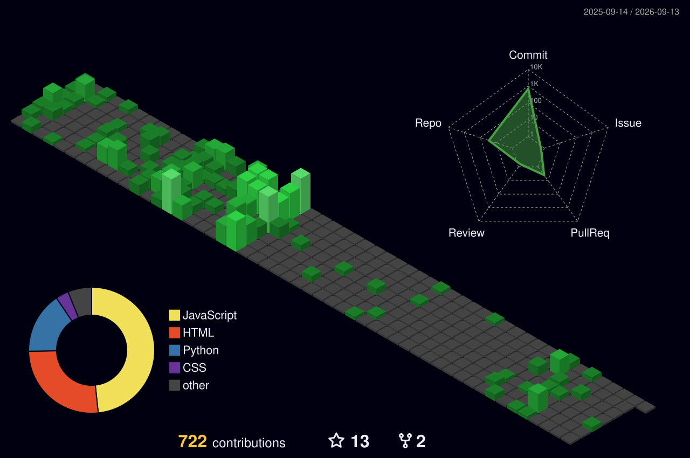

## 👋 About Me  

Hi, I’m **Shanmukha Penta**, a passionate **Full Stack Developer** focused on building production-ready applications.

✔ Clean UI  
✔ Scalable Backend  
✔ REST APIs  
✔ Dashboards  
✔ Deployment  

🎯 **Open to Frontend / Full Stack Fresher Roles**

## 🌟 Highlights  

🏆 Fresher with real-world projects  
🚀 Portfolio deployed  
🧠 Continuous learner  
💼 Ready for opportunities  

## 🌐 Portfolio  

🔗 https://shanmukha-portfolio-three.vercel.app  
🔗 https://github.com/shannu1653  

## 📄 Resume  

## 🛠 Tech Stack  

### Frontend  

### Backend  

### Database  

### Tools  

### 🔋 Skill Levels

React        ██████████░░ 85%  
JavaScript  █████████░░░ 80%  
Python      █████████░░░ 80%  
Django      ████████░░░░ 75%  
MySQL       ███████░░░░░ 70%  

## 🚀 Featured Projects  

### 🚦 Smart Traffic Management System

| Feature | Tech |
|--------|------|
| Frontend | React |
| Backend | Django |
| Auth | JWT |
| DB | MySQL |

🔗 https://github.com/shannu1653/Smart-Traffic

 

### 🎟 Premium Event Booking Platform  
CRUD • Tickets • Wishlist • Dark Mode  
🔗 Repo: https://github.com/shannu1653  

### 🏪 Smart Canteen Menu  
Admin Panel • Orders • Menu  
🔗 Repo: https://github.com/shannu1653  

### 🛒 FoodMart Web App  
Products • Cart • Responsive UI  
🔗 Repo: https://github.com/shannu1653  

## 📊 GitHub Overview  

- 🔭 Active Full Stack Developer  
- ⭐ Open Source Contributor  
- 🧠 Continuous Learner  
- 🚀 Building real-world projects  

👉 https://github.com/shannu1653  

## 🌌 3D Contribution Graph

  

<svg width="90%" height="6">
  <line x1="0" y1="3" x2="100%" y2="3" stroke="#00ff00" stroke-width="3">
    <animate attributeName="opacity" values="0.2;1;0.2" dur="1.5s" repeatCount="indefinite" />
  </line>
</svg>

## 🐍 Contribution Snake  

## 📬 Let’s Connect  

## 💡 What I Bring  

✔ Frontend expertise  
✔ REST APIs  
✔ Full Stack apps  
✔ Clean UI  
✔ Real projects  

🚀 Always learning. Always building.  
⚡ *Consistency beats talent.*

