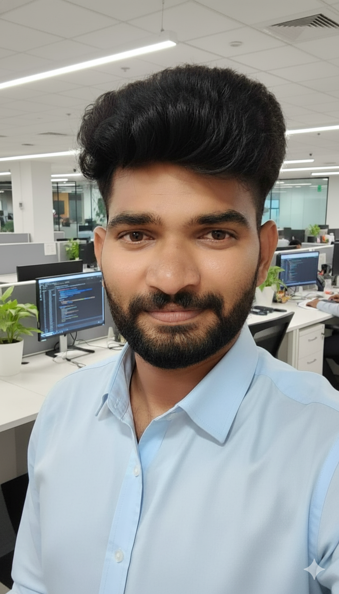

---

## 👋 About Me  

Hi, I’m **Shanmukha Penta**, a passionate **Full Stack Developer** focused on building real-world applications.

✔ Clean UI  
✔ Scalable Backend  
✔ REST APIs  
✔ Dashboards  
✔ Deployment  

🎯 Open to **Frontend / Full Stack Fresher Roles**

---

## 🌐 Portfolio  

🔗 https://shanmukha-portfolio-three.vercel.app  
🔗 https://github.com/shannu1653  

---

## 📄 Resume  

---

## 🛠 Tech Stack  

### Frontend  

### Backend  

### Database  

### Tools  

---

## 🚀 Projects  

---

## 📊 GitHub Stats  

---

## 🐍 Contribution Snake  

---

## 🔗 Connect  

---

## 💡 What I Bring  

✔ Frontend expertise  
✔ REST APIs  
✔ Full Stack apps  
✔ Clean UI  
✔ Real projects  

---

🚀 Always learning. Always building.  
⚡ *Consistency beats talent.*

